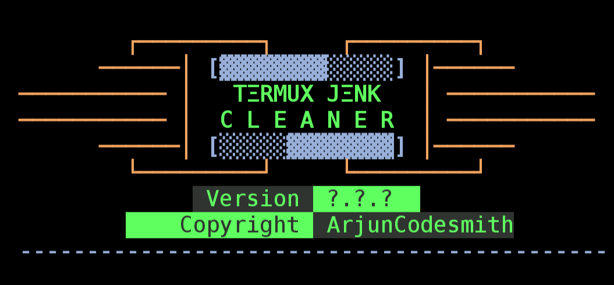

<p align="center">
<a href="https://github.com/ArjunCodesmith"></a>
</p>
<p align="center">
<a href="https://github.com/ArjunCodesmith"></a>
</a>
<p align="center">
<a href="https://github.com/ArjunCodesmith"></a>
<a href="https://github.com/ArjunCodesmith"></a>
<a href="https://github.com/ArjunCodesmith"></a>
</p>

## About Tool

Termux Junk Cleaner is a powerful junk cleanup tool designed to optimize and declutter your Termux environment. It offers a comprehensive set of features to clean up various unnecessary files, logs, cached data and more.

## Installation

- #### Clone the repository:
```bash
git clone https://github.com/ArjunCodesmith/termux-junk-cleaner.git
````
- #### Navigate to the project directory:
```bash
cd termux-junk-cleaner
```
- #### Give executable permission to the file
```bash
chmod +x termux-Junk-cleaner.sh
```
- #### Run the script:
 ```bash
 ./termux-junk-cleaner.sh
```

## Features

- #### Selective Cleanup:
Choose specific cleanup options tailored to your needs (cached packages, temporary files, logs).

-	 ##### Cache Cleanup: Remove redundant cache files to free up space.
-	 ##### Cached Packages Cleanup: Efficiently clean cached packages to enhance performance.
-	 ##### Unused Packages Removal: Safely remove unnecessary or unused packages.
-	 ##### Temporary Files Cleanup: Eliminate temporary files that may accumulate over time.
-	 ##### Temporary Backup Files Cleanup: Ensure a clean slate by removing temporary backup files.
-	 ##### Unnecessary Logs Cleanup: Improve system cleanliness by cleaning unnecessary logs.

- #### Detailed Logs:
The tool generates cleanup details in cleanup_log.txt.

    ## Notes

## Running Tests

To run the tool just type `clean` and hit enter.

The script will guide you through selective cleanup options, including cached packages, temporary files, and logs.


## Usage
Termux Junk Cleaner provides a flexible and user-friendly interface for cleanup operations. You can choose specific cleanup options, or run it interactively for a customized cleanup.
### Options

Interactive Mode:
```bash
bash cleaner_script.sh
```
Help:
```bash
bash cleaner_script.sh -h
```
Clean Cache Files:
```bash
bash cleaner_script.sh -c
```
Clean Cached Packages:
```bash
bash cleaner_script.sh -p
```
Remove Unnecessary Packages:
```bash
bash cleaner_script.sh -n
```
Clean Temporary Files:
```bash
bash cleaner_script.sh -t
```
Clean Temporary Backup Files:
```bash
bash cleaner_script.sh -b
```
Clean Unnecessary Logs:
```bash
bash cleaner_script.sh -l
```
Clean All Types of Junks:
```bash
cleaner_script.sh -a
```
